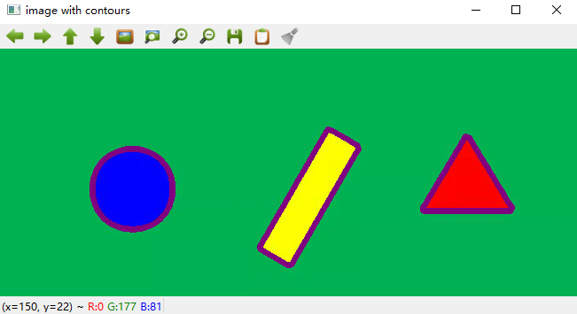
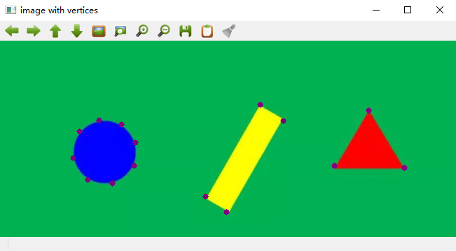
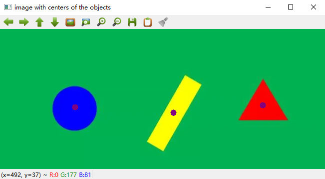
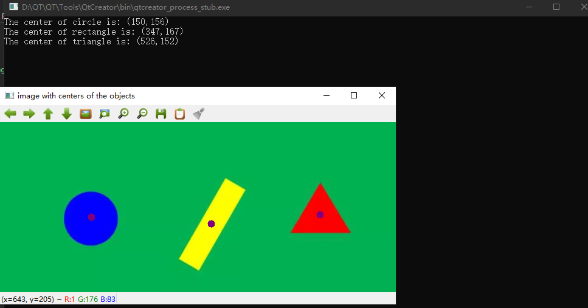

# 任务

利用opencv找出下图3个图形的中心。

# 项目结构
* 类Detector负责实现该任务，具体而言，其有3个成员方法：void set_img(Mat& img)，vector<Point> detect()和void print()。set_img方法负责接收图片，detect方法负责识别中心点，print函数负责在控制台打印出中心点。因此在main函数中的执行顺序为set_img->detect->print。
* main函数负责测试运行该Detector类。
  
# 实现原理
* 首先对图片进行边缘检测，然后根据边缘提取出每个图形的轮廓。

* 然后根据轮廓找出每一个图形的顶点，比如三角形有3个顶点，矩形有4个顶点，圆形有多于4个顶点。

* 然后通过计算每个顶点的中心值，将该中心值作为该图形的中心。
  

# 运行
在main函数里修改图片路径为自己本地图片所在位置即可运行。运行效果如下图所示：

